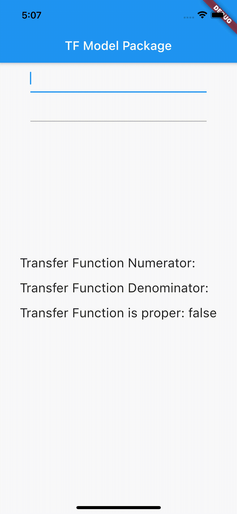
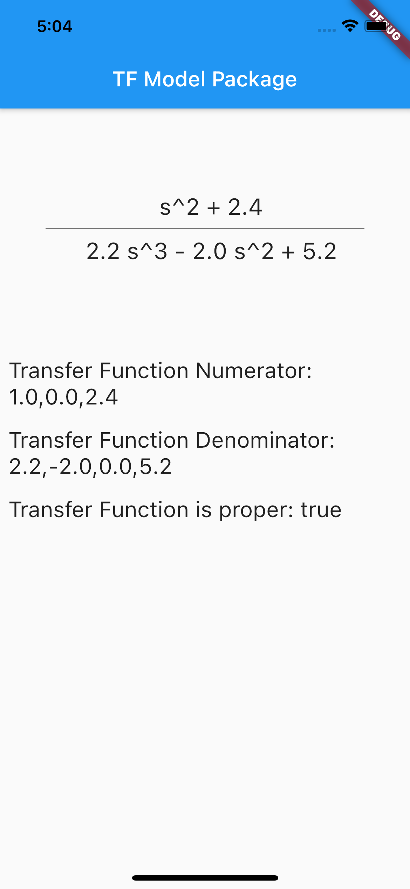
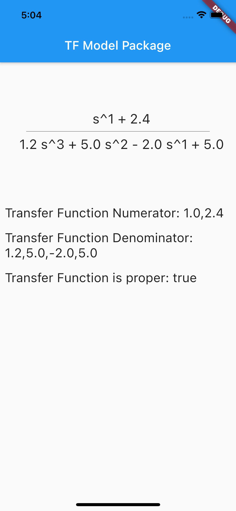

# tfmodel

A Flutter package helps to show transfer functions properly. It also includes a transfer function component widget.

<br/>
<br/>



<br/>
<br/>

## Installation

```yaml
dependencies:
  tfmodel: <latest_version>
```

<br/>
<br/>

## How To Use

```dart
var tfmodel = TFModel(
    numerator: "1 0 2.4",
    denominator: "2.2 -2 0 5.2",
    showFormatError: false,
  );

var tfComponent = TFComponent(
    system: tfmodel,
    // divider: Divider(),
    // denominatorTextStyle:  TextStyle(),
    // numeratorTextStyle: TextStyle(),
);
```

<br/>
<br/>
<view style="display: flex;">
    
    
</view>
<br/>
<br/>
